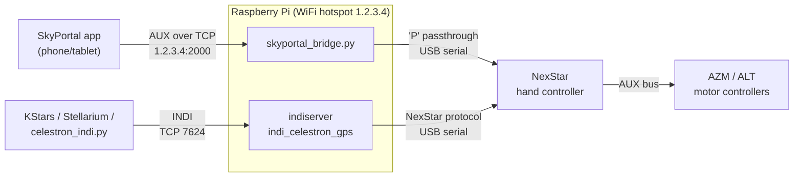

# celestron-skyportal-bridge

Turn a Raspberry Pi into a WiFi module for a Celestron NexStar telescope.

The official Celestron SkyPortal WiFi accessory is just a TCP endpoint at
`1.2.3.4:2000` speaking the AUX protocol. This project emulates it with a
Raspberry Pi connected to the **NexStar hand controller over USB**, so the
[SkyPortal app](https://www.celestron.com/pages/skyportal-mobile-app) can
point the telescope — and, at the same time, the Pi runs an **INDI server**
so KStars, Stellarium or the bundled Python client can control the scope
from any computer on the network.

Developed and tested on a **NexStar 127SLT**; it should work with any
NexStar mount whose hand controller supports the `P` passthrough command.

## Features

- **SkyPortal over WiFi** without the official (discontinued, pricey)
  Celestron accessory: the Pi broadcasts its own hotspot and answers at
  `1.2.3.4:2000`.
- **INDI server** (`indi_celestron_gps`) for desktop planetarium software
  and remote scripting.
- **Python client/CLI** (`celestron_indi.py`): status, GoTo, sync, manual
  slewing — usable as a library or from the command line, locally or from
  a remote PC.
- **Peaceful coexistence**: the serial port belongs to the INDI server;
  when SkyPortal connects, the bridge asks the INDI driver to release it
  automatically.
- Single `KEY=value` config file, auto-detection of the USB serial
  adapter, systemd services, one-command installer.

## How it works



SkyPortal talks AUX directly to the mount's motor controllers. The bridge
receives those AUX packets over TCP, encapsulates them in the hand
controller's `P` (passthrough) command, and relays the answers back. It
also impersonates the WiFi module itself (AUX device `0xB5`), which the
app queries on connection.

The hand controller's USB port is a single serial line, so the bridge and
the INDI driver cannot use it at the same time: when a SkyPortal client
connects, the bridge sends `CONNECTION.DISCONNECT=On` to the INDI driver
(via `indi_setprop`) and takes the port; reconnect the INDI driver when
you are done with the app (e.g. `celestron` CLI does it automatically on
the next use).

## Hardware

- Celestron NexStar mount with hand controller (tested: NexStar 127SLT)
- USB cable from the hand controller to the Raspberry Pi
  (mini-USB on recent controllers, or a serial/USB adapter on older ones)
- Raspberry Pi with WiFi (tested: Raspberry Pi OS Bookworm) — the onboard
  WiFi is used as the hotspot

## Installation

On the Raspberry Pi:

```sh
git clone https://github.com/marioproto92/celestron-skyportal-bridge.git
cd celestron-skyportal-bridge
sudo ./install.sh
```

The installer:

1. installs `indi-bin` (INDI server + Celestron driver), `python3-venv`
   and NetworkManager via `apt`;
2. copies the scripts to `/opt/celestron` and creates a virtualenv at
   `/opt/celestron/venv` with the Python dependencies;
3. installs `/etc/celestron-bridge.conf` (never overwrites an existing
   one) and the `celestron` CLI command;
4. installs and enables the `indiserver` and `skyportal-bridge` systemd
   services;
5. creates the WiFi hotspot with IP `1.2.3.4` that SkyPortal expects.

Options:

| Flag | Default | Meaning |
|------|---------|---------|
| `--user NAME` | the user invoking `sudo` | user the services run as |
| `--ssid NAME` | `Celestron` | hotspot network name |
| `--password PASS` | `celestron127` | hotspot WPA2 password (min 8 chars) |
| `--wifi-interface IF` | `wlan0` | interface used for the hotspot |

> **Note:** the hotspot turns the WiFi interface into an access point. If
> the Pi used that interface for internet access, use Ethernet or a second
> WiFi adapter instead.

## Configuration

`/etc/celestron-bridge.conf` (`KEY=value`; the `CELESTRON_CONF`
environment variable points to an alternate file):

| Key | Default | Meaning |
|-----|---------|---------|
| `SERIAL_PORT` | `auto` | hand controller port; `auto` picks the first entry in `/dev/serial/by-id/` |
| `SERIAL_BAUD` | `9600` | serial speed |
| `INDI_HOST` | `localhost` | INDI server host (for `celestron_indi.py`) |
| `INDI_PORT` | `7624` | INDI server port |
| `INDI_DEVICE` | `Celestron GPS` | INDI device name |
| `LOG_LEVEL` | `INFO` | bridge verbosity (`DEBUG`/`INFO`/`WARNING`/`ERROR`) |
| `LOG_FILE` | *(empty)* | bridge log file; empty = stderr/journald |

After editing, restart the bridge: `sudo systemctl restart skyportal-bridge`.

## Using SkyPortal

1. Power the telescope and do the star alignment on the hand controller
   as usual (the bridge does not replace alignment).
2. On the phone, join the Pi's WiFi network (default SSID `Celestron`,
   password `celestron127`).
3. Open SkyPortal → **Connection** → **Connect**. The app reaches the
   scope at `1.2.3.4:2000`; you can now tap an object and **GoTo**.
4. When you disconnect, the bridge stops the motors as a safety measure.

## Remote control via INDI

The `celestron` command (or `python celestron_indi.py`, which also works
from a remote PC — copy the single file and `pip install indipyclient`):

```sh
celestron                       # status and position
celestron goto 5.6 -5.4 --wait  # GoTo RA 5.6h DEC -5.4°, wait for the slew
celestron sync 5.6 -5.4         # tell the scope where it is pointing
celestron move e                # slew east until 'stop'
celestron stop                  # stop everything
celestron --host raspberrypi.local status   # from another machine
```

As a library:

```python
from celestron_indi import CelestronINDI

with CelestronINDI(host="raspberrypi.local") as scope:
    print(scope.get_radec())        # (hours, degrees)
    scope.goto(5.6, -5.4, wait=True)
```

The client is event-driven: it caches the INDI state pushed by the
server, so reads are instantaneous and waits (connection, end of slew)
react to events instead of polling.

Any INDI-aware software (KStars/Ekos, Stellarium, PHD2, ...) can also
connect to `raspberrypi:7624` directly.

## AUX protocol reference

Packets on TCP port 2000 (and on the mount's AUX bus):

```
0x3B  len  src  dst  cmd  [data...]  checksum
```

`len = 3 + n_data`; `checksum` is the two's complement of the sum of the
bytes from `len` through the last data byte. The bridge forwards to the
motor controllers (`dst` `0x10` AZM, `0x11` ALT) through the hand
controller's `P` command, and answers itself as the WiFi module
(`dst` `0xB5`).

Motor-controller commands handled (with expected response length):

| Cmd | Name | Resp | Cmd | Name | Resp |
|-----|------|------|-----|------|------|
| `0x01` | MC_GET_POSITION | 3 | `0x18` | MC_AT_INDEX | 1 |
| `0x02` | MC_GOTO_FAST | 0 | `0x19` | MC_SEEK_INDEX | 0 |
| `0x04` | MC_SET_POSITION | 0 | `0x24` | MC_MOVE_POS | 0 |
| `0x05` | MC_GET_MODEL | 2 | `0x25` | MC_MOVE_NEG | 0 |
| `0x06` | MC_SET_POS_GUIDERATE | 0 | `0x38` | MC_ENABLE_CORDWRAP | 0 |
| `0x07` | MC_SET_NEG_GUIDERATE | 0 | `0x39` | MC_DISABLE_CORDWRAP | 0 |
| `0x0B` | MC_LEVEL_START | 0 | `0x3A` | MC_SET_CORDWRAP_POS | 0 |
| `0x10` | MC_SET_POS_BACKLASH | 0 | `0x3B` | MC_POLL_CORDWRAP | 1 |
| `0x11` | MC_SET_NEG_BACKLASH | 0 | `0x3C` | MC_GET_CORDWRAP_POS | 3 |
| `0x12` | MC_LEVEL_DONE | 1 | `0x40` | MC_GET_POS_BACKLASH | 1 |
| `0x13` | MC_SLEW_DONE | 1 | `0x41` | MC_GET_NEG_BACKLASH | 1 |
| `0x17` | MC_GOTO_SLOW | 0 | `0x46` | MC_SET_AUTOGUIDE_RATE | 0 |
| | | | `0x47` | MC_GET_AUTOGUIDE_RATE | 1 |
| | | | `0xFE` | GET_VER | 2 |

Commands with more than 3 data bytes cannot be tunnelled through `P` and
are dropped (with a warning in the log).

## Troubleshooting

**SkyPortal does not find the telescope.** Check that the phone is on the
Pi's hotspot and that the bridge is running:
`systemctl status skyportal-bridge` and
`journalctl -u skyportal-bridge -f` while connecting.

**"serial port busy" in the bridge log.** Another process holds the hand
controller port. The bridge already asks the INDI driver to disconnect;
check for other consumers (`sudo lsof /dev/ttyUSB0`).

**The INDI driver won't connect after using SkyPortal.** The bridge holds
the port while a client is connected. Close the app (or wait for the
disconnect), then reconnect the driver — e.g. just run `celestron`.

**The hotspot is unstable or the Pi freezes.** Some USB WiFi dongles
(notably Realtek-based ones) crash in AP mode. Run the hotspot on the
Pi's **onboard** interface (`wlan0`, the installer default) and use the
dongle, if any, as a normal client.

**No USB serial adapter found.** With `SERIAL_PORT=auto` the bridge scans
`/dev/serial/by-id/`. Check the cable (`ls /dev/serial/by-id/`) or set an
explicit path in `/etc/celestron-bridge.conf`.

**`pip install` fails on the Pi ("externally managed environment").**
Raspberry Pi OS Bookworm blocks the system pip (PEP 668). Use the
virtualenv the installer creates (`/opt/celestron/venv`), which the
services and the `celestron` command already use.

## License

[GPL-3.0](LICENSE).
